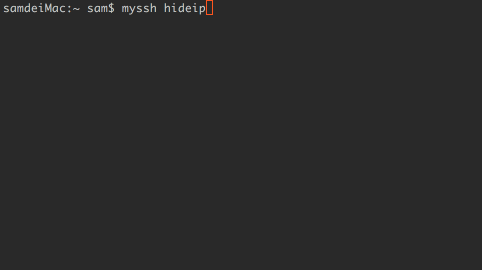

# myssh
Mac OS和Linux上的命令行ssh管理工具

- 操作多台服务器执行非交互性的指令
- 同步多台服务器文件




### 安装
1.必须安装pip

 
```
python setup.py build
python setup.py install
```

2.解压进入sshpass，编译安装sshpass

```
./configure
make &&make install
```

### 服务器配置
编辑服务器配置文件（文件在 ~/.myssh/myssh.yml）

```
myssh edit
```

>
如果运行myssh时出现这个错误 UnicodeEncodeError: 'ascii' codec can't encode characters
>
在~/.bash_profile中添加 export PYTHONIOENCODING=UTF-8


